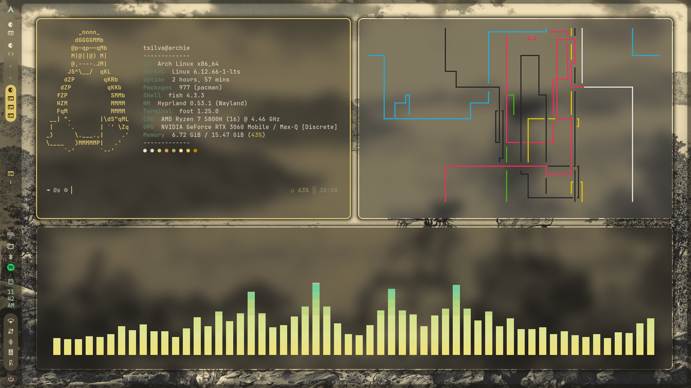
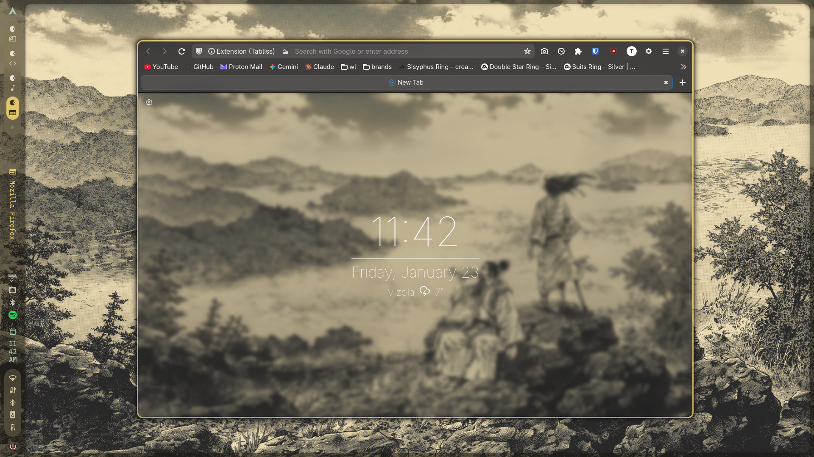
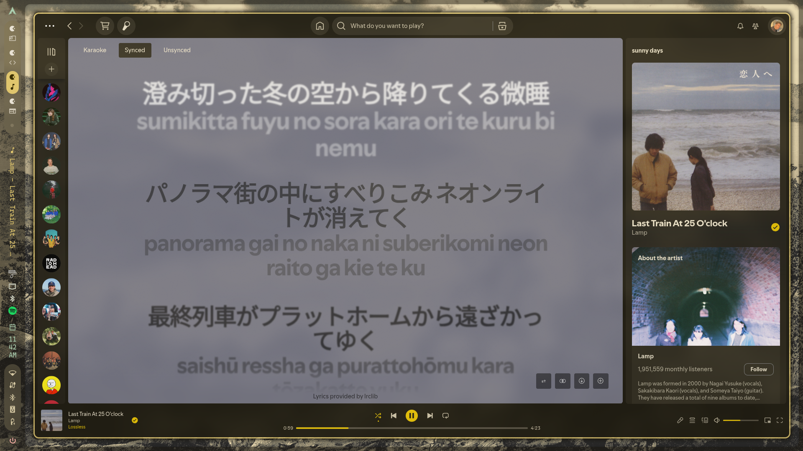
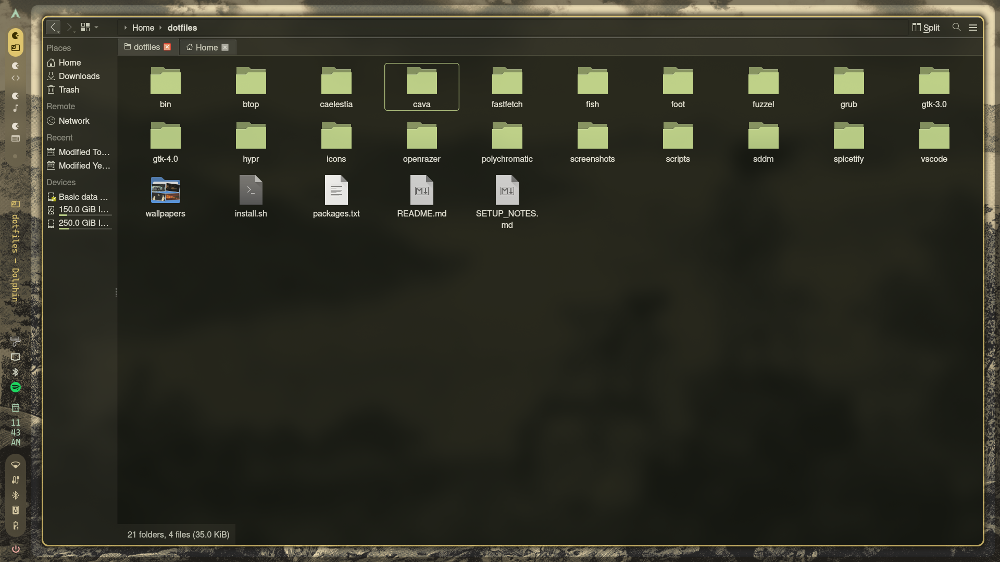
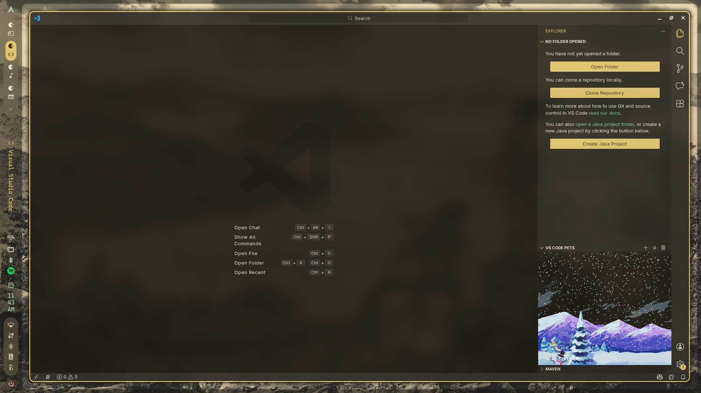

<div align="center">

# 🏠 dotfiles


**Arch Linux • Hyprland • Caelestia**

*A clean, modern desktop setup with dynamic theming*

</div>

---

> ⚠️ **Warning:** This setup is highly personalized and may not work correctly on all systems. The install script makes significant changes to your system configuration. Review the code before running and backup your existing configs.

## 📑 Table of Contents

- [Stack](#-stack)
- [Packages](#-packages-84)
- [Configs](#-configs)
- [Keybinds](#-keybinds)
- [Settings](#-settings)
- [Services](#-services)
- [Screenshots](#-screenshots)
- [Installation](#-installation)
- [Troubleshooting](#-troubleshooting)

---

## 🖥️ Stack

| Component | Software |
|:----------|:---------|
| **OS** | Arch Linux |
| **WM** | Hyprland |
| **Desktop Shell** | Caelestia (Quickshell) |
| **Terminal** | Foot |
| **CLI Shell** | Fish + Starship |
| **Launcher** | Fuzzel |
| **Browser** | Firefox |
| **File Manager** | Dolphin |
| **Audio** | PipeWire + WirePlumber |
| **Bluetooth** | BlueZ + Blueman |
| **Network** | NetworkManager + iwd |
| **Display Manager** | SDDM (Astronaut theme) |
| **Bootloader** | GRUB (Tartarus theme) |
| **GPU** | NVIDIA (open-dkms) |

---

## 📦 Packages (84)

### AUR Packages
*Installed via yay*

| Package | Description |
|:--------|:------------|
| `bibata-cursor-theme` | Modern cursor theme |
| `caelestia-meta` | Caelestia shell + CLI |
| `linux-wallpaperengine-git` | Steam wallpapers |
| `notion-app-electron` | Notion desktop app |
| `polychromatic` | Razer device GUI |
| `spicetify-cli` | Spotify theming |
| `spicetify-marketplace-bin` | Spicetify marketplace |
| `visual-studio-code-bin` | VS Code |
| `wallpaperengine-gui` | Wallpaper Engine GUI |
| `yay`, `yay-debug` | AUR helper |

### Fonts

| Font | Purpose |
|:-----|:--------|
| `inter-font` | UI font |
| `noto-fonts-cjk` | CJK character support |
| `noto-fonts-emoji` | Emoji support |
| `ttf-cascadia-code-nerd` | Nerd font with icons |
| `ttf-jetbrains-mono-nerd` | Terminal/editor font |

### Multilib
*Requires multilib repository (auto-enabled by install script)*

- `steam`

<details>
<summary><b>📋 Full package list</b></summary>

```
amd-ucode
base
base-devel
bibata-cursor-theme
blueman
bluez
bluez-utils
caelestia-meta
discord
dkms
dolphin
dunst
efibootmgr
firefox
fish
git
github-cli
gpicview
grim
grub
gst-plugin-pipewire
htop
hyprland
imagemagick
inter-font
iwd
kitty
libpulse
libva-nvidia-driver
linux
linux-firmware
linux-headers
linux-lts
linux-lts-headers
linux-wallpaperengine-git
nano
network-manager-applet
networkmanager
nodejs
notion-app-electron
noto-fonts-cjk
noto-fonts-emoji
npm
nvidia-open-dkms
openrazer-daemon
openrazer-driver-dkms
os-prober
pavucontrol
pipewire
pipewire-alsa
pipewire-jack
pipewire-pulse
polkit-kde-agent
polychromatic
python-openrazer
qt5-wayland
qt6-virtualkeyboard
qt6-wayland
sddm
slurp
smartmontools
sof-firmware
spicetify-cli
spicetify-marketplace-bin
spotify
steam
ttf-cascadia-code-nerd
ttf-jetbrains-mono-nerd
unzip
uwsm
vim
visual-studio-code-bin
wallpaperengine-gui
wget
wireless_tools
wireplumber
wofi
xdg-desktop-portal-hyprland
xdg-utils
xorg-server
xorg-xinit
yay
yay-debug
zram-generator
```

</details>

---

## 📁 Configs

### `caelestia/`
*User overrides for Caelestia shell*

| File | Purpose |
|:-----|:--------|
| `shell.json` | Quickshell settings (idle, bar, launcher) |
| `hypr-vars.conf` | Hyprland variable overrides |
| `hypr-user.conf` | Custom Hyprland config |

### `hypr/`
*Hyprland configuration*

| File | Purpose |
|:-----|:--------|
| `hyprland.conf` | Main config entry point |
| `hyprland/variables.conf` | Variables ($terminal, $browser) |
| `hyprland/keybinds.conf` | All keybinds |
| `scripts/wsaction.fish` | Workspace action script |

### `fish/`
*Fish shell config*

| File | Purpose |
|:-----|:--------|
| `config.fish` | Main config with aliases |
| `functions/fish_greeting.fish` | Greeting function |

### `foot/`
*Terminal emulator*

| Setting | Value |
|:--------|:------|
| Shell | Fish |
| Font | JetBrains Mono Nerd Font, 12pt |
| Transparency | 55% |
| Cursor | Beam, 1.5px |
| Scrollback | 10000 lines |
| Padding | 25x25 |

### `spicetify/`
*Spotify theming*

| File | Purpose |
|:-----|:--------|
| `config-xpui.ini` | Spicetify config |
| `Themes/caelestia/` | Caelestia theme files |

### `openrazer/`
*Razer peripheral daemon*

| File | Purpose |
|:-----|:--------|
| `razer.conf` | Daemon settings |
| `persistence.conf` | DPI persistence (1200 DPI) |

### Other Configs

| Directory | Purpose |
|:----------|:--------|
| `btop/` | System monitor + caelestia theme |
| `cava/` | Audio visualizer |
| `fastfetch/` | System info display |
| `polychromatic/` | Razer GUI preferences |
| `vscode/` | VS Code settings.json |
| `gtk-3.0/` & `gtk-4.0/` | GTK theme settings |
| `icons/` | Cursor theme (Bibata-Modern-Classic) |
| `grub/` | GRUB config + Tartarus theme |
| `sddm/` | SDDM config + Astronaut theme |
| `wallpapers/` | 25 wallpapers |
| `bin/` | Custom scripts (system-update) |

---

## ⌨️ Keybinds

### Variables
```conf
$terminal = foot
$browser = firefox
$fileExplorer = dolphin
```

### 🚀 Applications

| Keybind | Action |
|:--------|:-------|
| `Super + T` | Terminal |
| `Super + W` | Browser |
| `Super + F` | File explorer |
| `Super + M` | Spotify |
| `Super + N` | Notion |
| `Super + B` | Blueman |
| `Super + G` | GitHub Desktop |
| `Super + Shift + U` | System update |
| `Super + V` | Clipboard |
| `Super + .` | Emoji picker |
| `Ctrl + Alt + Escape` | qps (process manager) |

### 🪟 Window Management

| Keybind | Action |
|:--------|:-------|
| `Super + C` | Close window |
| `Super + Alt + Space` | Toggle floating |
| `Super + Shift + F` | Fullscreen |
| `Super + Alt + F` | Fullscreen (with border) |
| `Super + P` | Pin window |
| `Super + Arrows` | Move focus |
| `Super + Shift + Arrows` | Move window |
| `Super + Z + drag` | Move window |
| `Super + X + drag` | Resize window |
| `Super + - / +` | Adjust split ratio |
| `Super + Alt + Backslash` | Picture-in-picture |
| `Ctrl + Super + Backslash` | Center window |

### 🖼️ Workspaces

| Keybind | Action |
|:--------|:-------|
| `Super + 1-9,0` | Go to workspace |
| `Super + Alt + 1-9,0` | Move window to workspace |
| `Ctrl + Super + Left/Right` | Previous/next workspace |
| `Super + scroll` | Cycle workspaces |
| `Super + Page Up/Down` | Previous/next workspace |
| `Super + Alt + S` | Move to special workspace |

### 📸 Screenshots & Recording

| Keybind | Action |
|:--------|:-------|
| `Print` | Full screenshot to clipboard |
| `Super + Shift + S` | Region screenshot (freeze) |
| `Super + Shift + Alt + S` | Region screenshot |
| `Super + Alt + R` | Record screen with audio |
| `Ctrl + Alt + R` | Record screen |
| `Super + Shift + C` | Color picker |

### 🔊 Media & Volume

| Keybind | Action |
|:--------|:-------|
| `Ctrl + Super + Space` | Play/pause |
| `Ctrl + Super + =` | Next track |
| `Ctrl + Super + -` | Previous track |
| `XF86AudioRaiseVolume` | Volume up |
| `XF86AudioLowerVolume` | Volume down |
| `XF86AudioMute` | Toggle mute |
| `Super + Shift + M` | Toggle mute |

### ⚙️ System

| Keybind | Action |
|:--------|:-------|
| `Super + L` | Lock |
| `Super + Shift + L` | Suspend |
| `Ctrl + Alt + Delete` | Session menu |
| `Ctrl + Alt + C` | Clear notifications |
| `Super + K` | Show all panels |
| `Ctrl + Super + Shift + R` | Kill Quickshell |
| `Ctrl + Super + Alt + R` | Restart Quickshell |

---

## ⚙️ Settings

### Shell (`shell.json`)

| Setting | Value |
|:--------|:------|
| Lock timeout | 30 min |
| DPMS off | 45 min |
| Suspend | 60 min |
| Base transparency | 50% |
| Layer transparency | 35% |
| Persistent bar | Yes |
| Per-monitor workspaces | Yes |

### Hyprland Variables

```conf
$cursorTheme = Bibata-Modern-Classic
$cursorSize = 24
$windowOpacity = 0.90
$windowRounding = 10
$windowGapsIn = 10
$windowGapsOut = 40
$volumeStep = 10
```

### Fish Aliases

```fish
# Git
abbr ga 'git add .'
abbr gc 'git commit -am'
abbr gp 'git push'
abbr gpl 'git pull'
abbr gl 'git log'
abbr gs 'git status'
abbr gst 'git stash'
abbr gsp 'git stash pop'
abbr gsw 'git switch'
abbr gsm 'git switch main'
abbr gb 'git branch'
abbr gbd 'git branch -d'
abbr gco 'git checkout'
abbr lg 'lazygit'

# ls (using eza)
alias ls='eza --icons --group-directories-first -1'
abbr l 'ls'
abbr ll 'ls -l'
abbr la 'ls -a'
abbr lla 'ls -la'
```

### Razer Mouse

| Setting | Value |
|:--------|:------|
| Device | Viper V2 Pro |
| DPI | 1200 |
| Daemon | openrazer |
| GUI | polychromatic |

---

## 🔧 Services

### System Services
```bash
sudo systemctl enable bluetooth.service
sudo systemctl enable NetworkManager.service
sudo systemctl enable sddm.service
```

### User Services
```bash
systemctl --user enable openrazer-daemon.service
systemctl --user enable pipewire.socket
systemctl --user enable pipewire-pulse.socket
systemctl --user enable wireplumber.service
```
---

## 📸 Screenshots

<div align="center">

### 🖥️ Terminal & Workflow


### 🦊 Firefox


### 🎵 Spotify


### 📁 Dolphin


### 💻 VS Code


</div>

## 🚀 Installation

```bash
git clone https://github.com/T-silva15/dotfiles.git ~/dotfiles
cd ~/dotfiles
./install.sh
```

### What the script does

1. ✅ Enables multilib repository (for Steam)
2. ✅ Installs yay (AUR helper)
3. ✅ Installs all 84 packages (official + AUR)
4. ✅ Sets up Caelestia desktop with Hyprland
5. ✅ Copies all configs to their locations
6. ✅ Installs VS Code Caelestia extension
7. ✅ Applies Spicetify theme
8. ✅ Adds user to plugdev group (for Razer)
9. ✅ Sets up GRUB with Tartarus theme + os-prober
10. ✅ Sets up SDDM with Astronaut theme
11. ✅ Enables systemd services

### Post-install

1. **Reboot** your system
2. Install [Tartarus GRUB theme](https://github.com/AllJavi/tartarus-grub) manually
3. Set mouse DPI via polychromatic or razercfg
4. Log out and back in for group changes to take effect

---

## 🔍 Troubleshooting

### OpenRazer not working?
```bash
# Enable and start daemon
systemctl --user enable --now openrazer-daemon

# Add yourself to plugdev group (requires logout)
sudo gpasswd -a $USER plugdev
```

### Check Hyprland logs
```bash
cat ~/.local/share/hyprland/hyprland.log
```

### Spicetify not applied?
```bash
spicetify restore backup
spicetify backup apply
```

### NVIDIA issues?
```bash
# Check if modules are loaded
lsmod | grep nvidia
# Should show: nvidia, nvidia_modeset, nvidia_uvm
```

---

<div align="center">

Made with ❤️ on Arch Linux

</div>
